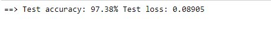
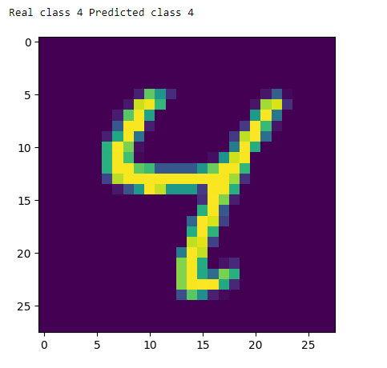

# MNIST-Digit-Classifier
This is an image classification project that classify handwritten digits using the MNIST dataset. 
  
It is a simple project which makes use of a simple architecture in order to correctly classify handwritten digits with a high test accuracy of 97%.



## Table of contents
* [Project description](#MNIST-Digit-Classifier)
* [Technologies used](#technologies)
* [Setup](#setup)
* [Image example](#Here_is_an_example_of_the_model_being_used_to_predict_the_digit_written_in_an_image:)


## Technologies
* python 3.6
* opencv-python-headless 4.5.3.56
* matplotlib 3.4.3
* numpy 1.21.2
* pillow 7.0.0
* bokeh 2.1.1
* torch 1.11.0
* torchvision 0.12.0
* tqdm 4.63.0
* ipywidgets 7.7.0
* livelossplot 0.5.4
* pytest 7.1.1
* pandas 1.3.5
* seaborn 0.11.2
* jupyter 1.0.0
* ipykernel 4.10.0  
**NB:** Please note that the version numbers noted here are not strict.

## Setup
The project is easy to setup and run.
- First you want to ensure you have python installed on your machine.
- Secondly having anaconda setup on your system is highly recommended.
- Install the project dependencies using the `requirement.txt` file: (or do it through the notebook)
  
  ```python
  pip install -r requirements.txt
  ```
- Run the notebook cells one after the other.

### Here is an example of the model being used to predict the digit written in an image:

  
